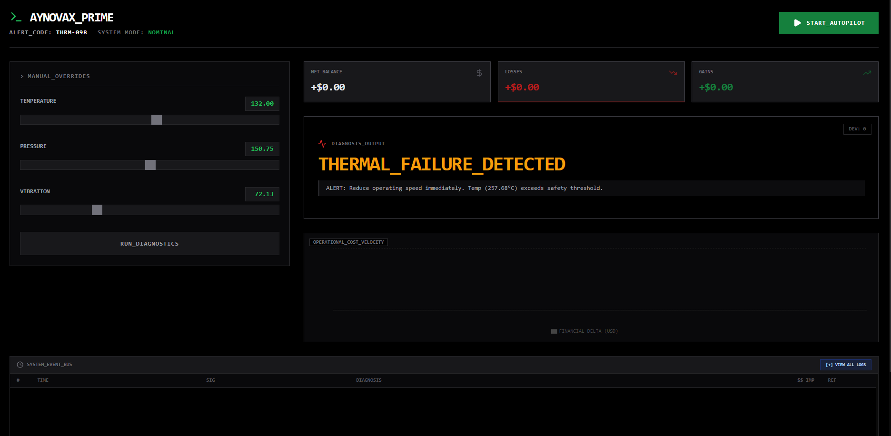
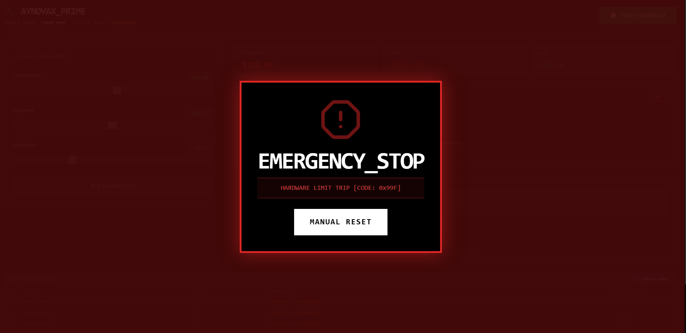
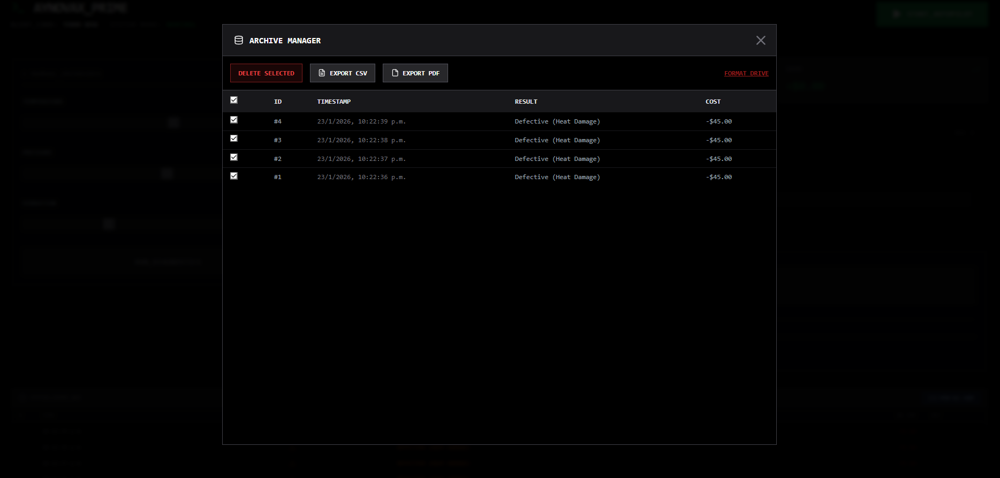

# AynovaX Prime Twin

## Español

Dashboard de control y monitoreo para un entorno industrial simulado (Digital Twin).
El sistema procesa telemetría en tiempo real (Temperatura, Presión y Vibración) y utiliza un modelo de detección de anomalías para anticipar fallas operativas, calculando su impacto financiero en tiempo real.

El objetivo principal es apoyar la toma de decisiones bajo condiciones críticas, correlacionando señales físicas con métricas económicas operativas.

### ¿Qué resuelve?
La falta de visibilidad clara sobre el estado de los equipos y el impacto real de las fallas en la operación.

### ¿Para qué?
Para monitorear condiciones en tiempo real, detectar anomalías y apoyar decisiones operativas con datos concretos.

### ¿Qué reduce?
Reduce paros no planeados, tiempos de reacción y pérdidas económicas asociadas a fallas.

### Capturas del Sistema

**Dashboard Principal (Operación Nominal)**  
Vista general del operador. El cálculo de costos operativos (energía vs. ganancia) es dinámico y depende de la carga de presión de la bomba.


**Alerta de Parada de Emergencia**  
El sistema bloquea automáticamente la simulación cuando detecta condiciones críticas (ej. código THRM-098) para proteger el hardware simulado.


**Bus de Eventos (Logs)**  
Registro crudo de diagnósticos y transacciones del sistema, con opción de exportación a CSV y PDF.


---

## English

Control and monitoring dashboard for an industrial digital twin environment (PLC_MAIN_01).
The system processes real-time telemetry (Temperature, Pressure, Vibration) and applies an anomaly detection model to anticipate operational failures, calculating their financial impact on the fly.

The project focuses on operational visibility and decision support under fault conditions.

### What does it solve?
Lack of clear visibility into equipment health and the real operational impact of failures.

### What is it for?
To monitor real-time conditions, detect anomalies, and support operational decisions with concrete data.

### What does it reduce?
It reduces unplanned downtime, reaction time, and financial losses caused by operational failures.


### System Screenshots

**Main Dashboard (Nominal Operation)**  
Operator overview. Operational cost calculation (energy vs. profit) is dynamic and varies according to pump pressure load.


**Emergency Stop Alert**  
The system automatically locks the simulation when critical conditions are detected (e.g. THRM-098) to prevent damage.


**Event Bus (Logs)**  
Raw diagnostics and transaction records with CSV and PDF export support.


---

### How to run (Local)

The project requires two active terminals.

#### 1. Backend And Frontend (Python / FastAPI)

Important: Activate your virtual environment (venv) before running the backend.  
If not activated, Python will not find required dependencies such as `joblib`.

```bash
cd backend
# pip install -r requirements.txt (first run only)
uvicorn app.main:app --reload --port 8000

cd frontend
npm run dev